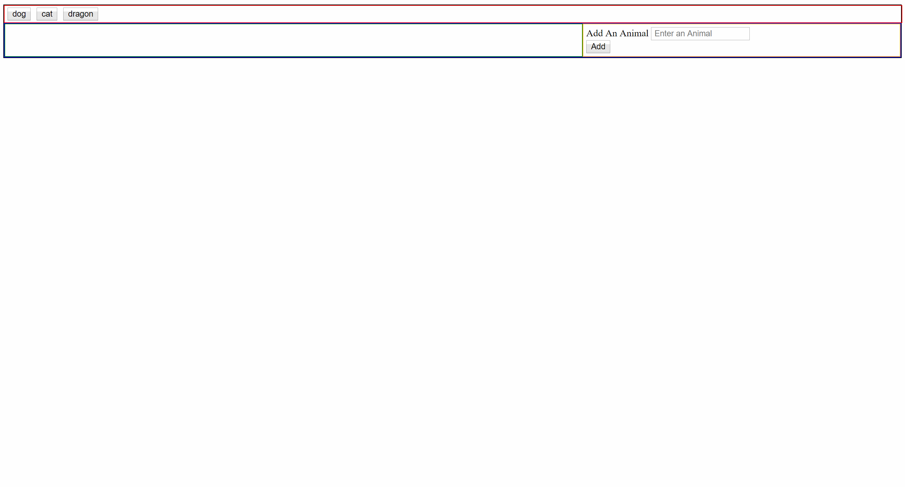

# GifTastic
This webpage will use GIPHY API to display popular images that the user chooses.

This application functions by pressing a button labeled with an animal. The page then loads 10 gifs from Giphy API of that animal.
When another button is pressed, the page removes the gifs currently being displayed and displays the new 10. The user could also input his own animal and when the button "Add" is pressed, the button will appear next to the others. 

# Pseudocode
I could not figure out how to make the gifs stop/start. I looked back into the assignment where we did make them stop/start by clicking them but in that file, there were two separate files. An animated and a still. I guess I could screen shot each one and save it into the  tag but if its run off an API, the images will constantly update. I spent hours looking for a method or something that would serve my purpose but I came up short and time ran out. I will update this in the following days to incorporate the stills/animated gifs.
